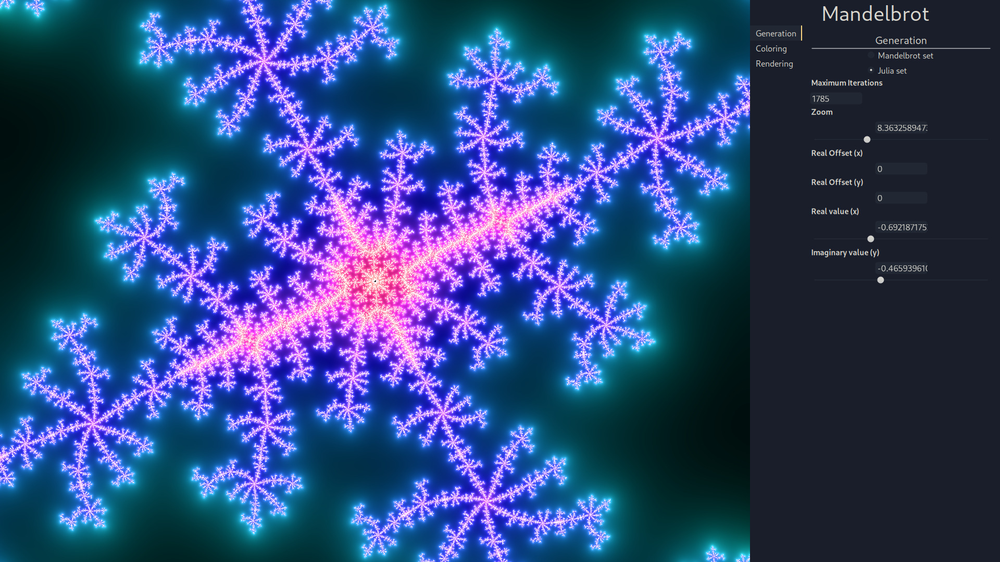

# Fractal Generation App

This is a simple Rust application made with Druid which provides the tools to create complex fractal images. It uses a highly-performant multi-threaded and SIMD-enabled backend to compute fractals in near-real-time on the CPU.

## Examples

Example output:


Screenshot



## Compiling

Currently, the backend works best when the target feature `avx2` is available, as this enables SIMD operations.

```sh
# debug [non-release] builds are significantly slower, useful for development only
cargo build --release
```

## Running

```sh
cargo run --release
```

## TODO:

- [ ] Current implementation of progressive rendering doubles the amount of work. Pixels which are already calculated should not be re-rendered. This could be done by scaling only the height to allow SIMD execution to work normally on the width of the image.
- [ ] The render tab needs an aspect-ratio corrected render preview. This will require a controller for the size of a container around RenderView.
- [ ] The info text at the bottom of the settings pane should be more fully utilized. This is probably best implemented with a [ExtEventSink](https://docs.rs/druid/0.7.0/druid/struct.ExtEventSink.html).
- [ ] I would like to add support for the [Newton Fractal](https://en.wikipedia.org/wiki/Newton_fractal), in addition to MandelBrot and Julia. Other fractals are possible as well.
- [ ] _LONG TERM_: Precision could be greatly increased by utilizing [abitrary-precision floats](https://docs.rs/gmp-mpfr-sys/latest/gmp_mpfr_sys/) and [perturbation](https://en.wikipedia.org/wiki/Plotting_algorithms_for_the_Mandelbrot_set#Perturbation_theory_and_series_approximation).
